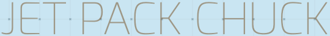

<a name="readme-top"></a>


[![MIT License][license-shield]][license-url]
[![LinkedIn][linkedin-shield]][linkedin-url]


<br />
<div align="center">
  <a href="https://github.com/Scynes/Jet-Pack-Chuck">
    
  </a>


  <p align="center">
    A flappy game type clone, mixed with Chuck Norris badassery.
    <br />
    <br />
    <a href="https://scynes.github.io/Jet-Pack-Chuck/">View Demo</a>
    ·
    <a href="https://github.com/Scynes/Jet-Pack-Chuck/issues">Report Bug</a>
    ·
    <a href="https://github.com/Scynes/Jet-Pack-Chuck/issues">Request Feature</a>
  </p>
</div>


<!-- TABLE OF CONTENTS -->
<details>
  <summary>Table of Contents</summary>
  <ol>
    <li>
      <a href="#about-the-project">About The Project</a>
      <ul>
        <li><a href="#built-with">Built With</a></li>
      </ul>
    </li>
    <li>
      <a href="#getting-started">Getting Started</a>
      <ul>
        <li><a href="#installation">Installation</a></li>
      </ul>
    </li>
    <li><a href="#roadmap">Roadmap</a></li>
    <li><a href="#contributing">Contributing</a></li>
    <li><a href="#license">License</a></li>
    <li><a href="#contact">Contact</a></li>
    <li><a href="#acknowledgments">Acknowledgments</a></li>
  </ol>
</details>


<!-- ABOUT THE PROJECT -->
## About The Project

This project was all about learning how to make a responsive application.  I figured what better way to learn about responsiveness than to create a game which always requests responsive input from a person to play! So as a starter project I decided to go in with the goal of creating what I deemed should be relatively simply - a game with heavy inspiration from the internet hit 'Flappy Bird' but with my own twist on it - the badassness that is Chuck Norris!

This project as a whole incorporates beginner concepts of learning -
* <b>AJAX</b> (chuck norris API calls for the jokes)
* <b>jQuery</b> (for manipulating DOM elements)
* <b>Event Listeners</b> (for handling player input)
* <b>JSON</b> (locally for handling game data storage)

I also learned a few other neat tricks such as using CSS to tranisiton background, which I used for incorporating a 'dark mode'.


<div align="center">
    
    </a>
</div>


<p align="right">(<a href="#readme-top">back to top</a>)</p>


### Built With


* [![JavaScript][JS]][JavaScript-url]
* [![JQuery][JQuery.com]][JQuery-url]
* [![HTML5][HTML5.com]][HTML5-url]
* [![CSS][CSS3]][CSS3-url]

<p align="right">(<a href="#readme-top">back to top</a>)</p>


### Installation

_If you'd like to use this as a resource to build upon, feel free to clone the repo locally using the below git command._


   ```sh
   git clone https://github.com/Scynes/Jet-Pack-Chuck.git
   ```


<p align="right">(<a href="#readme-top">back to top</a>)</p>


<!-- USAGE EXAMPLES -->
## How to Play!

--


<p align="right">(<a href="#readme-top">back to top</a>)</p>


## Roadmap

- [x] Add Collision Mapping
- [x] Add Dynamic Sounds
- [x] Add Dark Mode (website)
- [ ] Add Sounds Toggle
- [ ] Game Difficulty Support
    - [x] Easy
    - [ ] Hard
    - [ ] Expert
    - [ ] Master

See the [open issues](https://github.com/Scynes/Jet-Pack-Chuck/issues) for a full list of proposed features (and known issues).

<p align="right">(<a href="#readme-top">back to top</a>)</p>


## Contributing
If you have a game feature suggestion, please open an issue with the tag " game enhancement". Alternatively, fork the project and open a pull request.


1. Fork the Project
2. Create your Feature Branch (`git checkout -b enhancement`)
3. Commit your Changes (`git commit -m 'game enhancement'`)
4. Push to the Branch (`git push origin enhancement`)
5. Open a Pull Request

<p align="right">(<a href="#readme-top">back to top</a>)</p>


<!-- LICENSE -->
## License

Distributed under the GNU General Public License v3.0. See `LICENSE.txt` for more information.

<p align="right">(<a href="#readme-top">back to top</a>)</p>


<!-- CONTACT -->
## Contact

Feel free to contact me through my LinkedIn link at the top if you have any questions!

<p align="right">(<a href="#readme-top">back to top</a>)</p>


<!-- ACKNOWLEDGMENTS -->
## Acknowledgments


* [Choose an Open Source License](https://choosealicense.com)

* [Code Explained](https://www.codeexplained.dev)
* [Img Shields](https://shields.io)
* [GitHub Pages](https://pages.github.com)
* [Font Awesome](https://fontawesome.com)

<p align="right">(<a href="#readme-top">back to top</a>)</p>


[license-shield]: https://img.shields.io/github/license/othneildrew/Best-README-Template.svg?style=for-the-badge
[license-url]: https://github.com/Scynes/Jet-Pack-Chuck/blob/master/LICENSE.txt
[linkedin-shield]: https://img.shields.io/badge/-LinkedIn-black.svg?style=for-the-badge&logo=linkedin&colorB=555
[linkedin-url]: https://www.linkedin.com/in/dustin-greyfield-web-developer/

[JQuery.com]: https://img.shields.io/badge/jQuery-0769AD?style=for-the-badge&logo=JQuery&logoColor=white
[JQuery-url]: https://jquery.com 
[HTML5.com]: https://img.shields.io/badge/HTML5-E34F26?style=for-the-badge&logo=HTML5&logoColor=white
[HTML5-url]: https://www.w3.org
[JS]: https://img.shields.io/badge/-JavaScript-222?logo=javascript&logoColor=yellow&fontColor=yellow&style=for-the-badge
[JavaScript-url]: https://developer.mozilla.org/en-US/docs/Web/JavaScript
[CSS3]: https://img.shields.io/badge/CSS3-000?style=for-the-badge&logo=CSS3&logoColor=blue
[CSS3-url]: https://developer.mozilla.org/en-US/docs/Web/CSS
